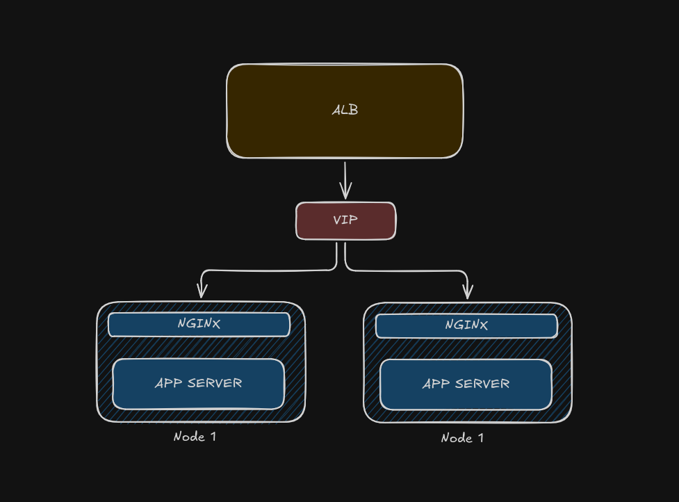

# 2-Node HA Cluster (Pacemaker + Corosync + Nginx)

A simple 2-node High Availability cluster built on AWS EC2. Each node runs **Nginx** as a reverse proxy in front of a lightweight **Python HTTP server**, with **Pacemaker** and **Corosync** managing failover of the application and floating IP between nodes.

---

<video src="https://github.com/user-attachments/assets/f52a8de9-5f29-4784-b813-22edc0ddd711" controls="controls" width="100%"></video>

---

## Architecture



* 2x EC2 Ubuntu instances in the same subnet, forming a Corosync/Pacemaker cluster.

* Each node runs the same stack: `serve.py` (Python HTTP server) behind Nginx (reverse proxy on port 80).

* Pacemaker manages the application resource (start/stop/move), so the systemd service is **never enabled directly** — cluster resource management owns the lifecycle.

* An IAM role attached to both nodes allows AWS CLI calls (e.g., to move a secondary private IP as part of failover automation).

---

## Prerequisites

- AWS account with permission to create EC2 instances, security groups, and IAM roles/policies.
- 2x EC2 Ubuntu instances, deployed in the **same subnet**.
- Basic familiarity with `systemd`, `crm`/`crmsh`, and AWS CLI.

---

## Setup Steps

### 1. Provision the instances
- Create 2 EC2 Ubuntu instances within the same subnet.
- Add a secondary private IP to any one of the instance which will act as VIP

### 2. Configure security groups
Update the security group on **both** nodes to allow:
- **ICMP** (for connectivity testing between nodes).
- **UDP ports 5403–5412** (for Corosync cluster communication).

### 3. Update `/etc/hosts` on both nodes
Add the private IPs of both instances to `/etc/hosts` on **both** nodes:

```
172.31.42.102 node1
172.31.38.219 node2
```

### 4. Verify connectivity
Once the security group rules are in place, ping `node2` from `node1` (and vice versa) — you should get a response.

### 5. Update and upgrade packages
```bash
sudo apt update && sudo apt upgrade
```

### 6. Install cluster packages
```bash
sudo apt install -y pacemaker corosync crmsh
sudo apt install -y resource-agents-extra
```

### 7. Configure Corosync
Update the Corosync configuration using the reference file: `configs/corosync.conf`.

### 8. Restart cluster services
```bash
sudo systemctl restart corosync
sudo systemctl restart pacemaker
```

### 9. Verify cluster status
```bash
sudo crm status
```
You should see both nodes listed as online (see `assets/crm_status.png` for a reference screenshot).

### 10. Set up the IAM role
Create an IAM role and policy, and attach it to **both** nodes. The policy is available at `configs/IAMpolicy.json`.

### 11. Install the AWS CLI
```bash
curl "https://awscli.amazonaws.com/awscli-exe-linux-aarch64.zip" -o "awscliv2.zip"
unzip awscliv2.zip
sudo ./aws/install
```

### 12. Verify the IAM role is attached
```bash
aws sts get-caller-identity
```
Expected output should reflect the attached role, for example:
```json
{
    "UserId": "<your_user_id>",
    "Account": "<your_account_id>",
    "Arn": "arn:aws:sts::419717495508:assumed-role/EC2SecondaryPrivateIPRole/i-04471bd41417529f3"
}
```

### 13. Set up the application server
The application server (`server/serve.py`) is a simple Python HTTP server. Manage it via systemd using the reference unit file at `configs/systemd.txt`.

> ⚠️ **Do not enable the service.** Pacemaker will manage its start/stop/move lifecycle — enabling it independently via systemd will conflict with cluster management.

### 14. Install Nginx
```bash
sudo apt install nginx
```

### 15. Configure Nginx
Update the Nginx configuration using the reference file: `configs/nginxconf`. Nginx acts as the reverse proxy in front of `serve.py`.

### 16. Open port 80 (temporary, dev-only)
Open port 80 in the security group for all IPs so you can verify the app is reachable from a browser:
```
http://<public_ip_of_the_node>
```
> ⚠️ This is for **development/testing purposes only**. Restrict this rule again before moving to production.

### 17. Configure CRM to manage cluster resources
Configure `crm` to manage the application and any related resources (e.g., the floating IP).

- Reference documentation: [crmsh man pages](https://crmsh.github.io/man-5.0/) — a genuinely great resource for learning `crmsh`.
- Reference CIB configuration used in this setup: `configs/pacemaker-cib.txt`.

### 18. Test failover
Validate the cluster behaves correctly under failure conditions:

- **Simulate a communication failure** by stopping Corosync on one node:
  ```bash
  sudo systemctl stop corosync
  ```
- **Manually move a resource** between nodes:
  ```bash
  sudo crm resource move <resource_name> <destination_node>
  ```

Either action should stop the services on the current node and bring them up on the other node.

---

## Repository Reference

| Path | Purpose |
|---|---|
| `server/serve.py` | Python HTTP application server |
| `configs/corosync.conf` | Corosync cluster communication config |
| `configs/pacemaker-cib.txt` | Reference Pacemaker CIB configuration |
| `configs/systemd.txt` | systemd unit reference for `serve.py` |
| `configs/nginxconf` | Nginx reverse proxy configuration |
| `configs/IAMpolicy.json` | IAM policy attached to both nodes |
| `assets/crm_status.png` | Expected `crm status` output (both nodes online) |
| `assets/Screencast_20260919_175052.webm` | Demo screen recording of the cluster in action |

---

## Notes

- Secondary private IP movement between nodes is handled via AWS CLI calls (enabled by the attached IAM role) as part of the failover flow — see `configs/IAMpolicy.json` for the exact permissions granted.
- Always re-lock down port 80 (and any other dev-only rules) before treating this setup as production-ready.
